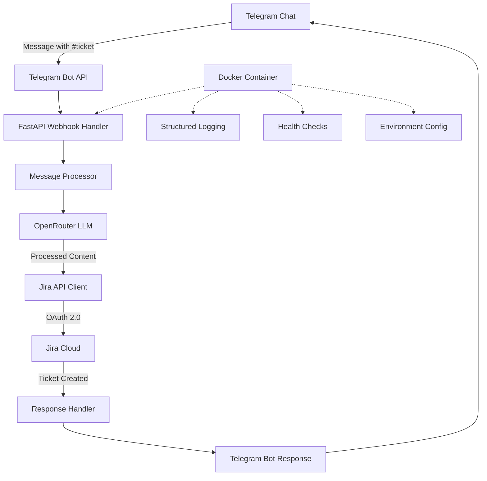
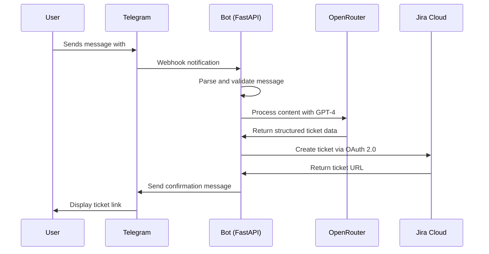

# TG-Jira Bot

A Telegram bot that monitors chat messages for "#ticket" hashtags and automatically creates Jira tickets using OpenRouter LLM for intelligent content processing.

## Architecture Overview

This bot integrates three main services:
- **Telegram Bot API** for message monitoring
- **OpenRouter LLM** (GPT-4 Turbo) for intelligent ticket content processing
- **Jira Cloud API** with OAuth 2.0 for secure ticket creation



## Features

### Core Functionality
- **Hashtag Detection**: Monitors for "#ticket" in any position within messages
- **Intelligent Processing**: Uses GPT-4 Turbo to extract structured ticket information
- **Automatic Ticket Creation**: Creates Jira tickets with processed content
- **User Feedback**: Responds with ticket links and confirmation

### LLM Processing Capabilities
- **Smart Title Generation**: Creates concise, descriptive ticket titles
- **Detailed Descriptions**: Expands brief messages into comprehensive descriptions
- **Priority Assessment**: Automatically assigns priority levels (High/Medium/Low)
- **Issue Type Classification**: Categorizes as Bug/Task/Story/etc.
- **Label Extraction**: Identifies relevant labels and components

### Technical Features
- **OAuth 2.0 Authentication**: Secure Jira integration with automatic token refresh
- **Webhook-based**: Real-time message processing via FastAPI webhooks
- **Docker Deployment**: Containerized with health checks and structured logging
- **Error Handling**: Comprehensive error handling with user-friendly messages
- **Rate Limiting**: Built-in protection against API abuse

## Project Structure

```
tgm-jira-bot/
├── src/
│   ├── __init__.py
│   ├── main.py                 # FastAPI application entry point
│   ├── bot/
│   │   ├── __init__.py
│   │   ├── telegram_bot.py     # Telegram bot setup and handlers
│   │   └── message_processor.py # Message parsing and validation
│   ├── integrations/
│   │   ├── __init__.py
│   │   ├── openrouter_client.py # OpenRouter LLM integration
│   │   └── jira_client.py      # Jira OAuth 2.0 and API client
│   ├── models/
│   │   ├── __init__.py
│   │   ├── ticket.py           # Ticket data models
│   │   └── config.py           # Configuration models
│   └── utils/
│       ├── __init__.py
│       ├── logger.py           # Structured logging setup
│       └── health.py           # Health check endpoints
├── tests/
│   ├── __init__.py
│   ├── test_bot.py
│   ├── test_integrations.py
│   └── test_message_processor.py
├── config/
│   ├── logging.yaml            # Logging configuration
│   └── .env.example            # Environment variables template
├── docker/
│   ├── Dockerfile
│   └── docker-compose.yml
├── requirements.txt
├── requirements-dev.txt
├── README.md
└── .gitignore
```

## Data Flow



## Prerequisites

### Required Accounts and Credentials
1. **Telegram Bot Token**
   - Create a bot via [@BotFather](https://t.me/botfather)
   - Obtain the bot token

2. **OpenRouter API Key**
   - Sign up at [OpenRouter](https://openrouter.ai/)
   - Generate an API key
   - Ensure sufficient credits for GPT-4 Turbo usage

3. **Jira Cloud OAuth 2.0 Credentials**
   - Access to a Jira Cloud instance
   - OAuth 2.0 app credentials (Client ID and Secret)
   - Appropriate permissions for ticket creation

### System Requirements
- Docker and Docker Compose
- Python 3.11+ (for local development)
- Internet connectivity for API access

## Quick Start

### Automated Setup (Recommended)
```bash
# Clone the repository
git clone <repository-url>
cd tgm-jira-bot

# Run automated setup
python setup.py

# Activate virtual environment
source venv/bin/activate  # On Windows: venv\Scripts\activate

# Edit .env with your credentials (created from template)
nano .env

# Start development server
python run_dev.py
```

## Installation and Setup

### 1. Clone the Repository
```bash
git clone <repository-url>
cd tgm-jira-bot
```

### 2. Environment Configuration
```bash
cp config/.env.example .env
```

Edit `.env` with your credentials:
```bash
# Telegram Bot
TELEGRAM_BOT_TOKEN=your_bot_token_here
TELEGRAM_WEBHOOK_URL=https://your-domain.com/webhook

# OpenRouter
OPENROUTER_API_KEY=your_openrouter_key_here
OPENROUTER_MODEL=openai/gpt-4-turbo

# Jira OAuth 2.0
JIRA_CLOUD_URL=https://your-domain.atlassian.net
JIRA_CLIENT_ID=your_oauth_client_id
JIRA_CLIENT_SECRET=your_oauth_client_secret
JIRA_PROJECT_KEY=your_project_key

# Application
LOG_LEVEL=INFO
ENVIRONMENT=development
SECRET_KEY=your_secret_key_here_change_in_production
```

### 3. Docker Deployment
```bash
# Build and start the container
docker-compose up -d

# View logs
docker-compose logs -f

# Stop the container
docker-compose down
```

### 4. Local Development Setup
```bash
# Create virtual environment
python -m venv venv
source venv/bin/activate  # On Windows: venv\Scripts\activate

# Install dependencies
pip install -r requirements-dev.txt

# Run the application
python run_dev.py
```

## Configuration

### Environment Variables

| Variable | Description | Required | Default |
|----------|-------------|----------|---------|
| `TELEGRAM_BOT_TOKEN` | Telegram bot token from BotFather | Yes | - |
| `TELEGRAM_WEBHOOK_URL` | Public URL for webhook endpoint | Yes | - |
| `OPENROUTER_API_KEY` | OpenRouter API key | Yes | - |
| `OPENROUTER_MODEL` | LLM model to use | No | `openai/gpt-4-turbo` |
| `JIRA_CLOUD_URL` | Jira Cloud instance URL | Yes | - |
| `JIRA_CLIENT_ID` | OAuth 2.0 Client ID | Yes | - |
| `JIRA_CLIENT_SECRET` | OAuth 2.0 Client Secret | Yes | - |
| `JIRA_PROJECT_KEY` | Target Jira project key | Yes | - |
| `LOG_LEVEL` | Logging level | No | `INFO` |
| `ENVIRONMENT` | Environment name | No | `development` |

### Webhook Setup

1. **Set Webhook URL**: Configure your Telegram bot webhook to point to your deployed instance:
   ```bash
   curl -X POST "https://api.telegram.org/bot<YOUR_BOT_TOKEN>/setWebhook" \
        -H "Content-Type: application/json" \
        -d '{"url": "https://your-domain.com/webhook"}'
   ```

2. **Verify Webhook**: Check webhook status:
   ```bash
   curl "https://api.telegram.org/bot<YOUR_BOT_TOKEN>/getWebhookInfo"
   ```

## Usage

### Basic Usage
1. Add the bot to your Telegram chat
2. Send a message containing `#ticket` followed by your issue description
3. The bot will process the message and create a Jira ticket
4. Receive a confirmation message with the ticket link

### Example Messages
```
#ticket The login button is not working on the mobile app

#ticket High priority: Database connection timeout errors occurring frequently

#ticket Feature request: Add dark mode to the user dashboard
```

### LLM Processing
The bot uses GPT-4 Turbo to intelligently process your message and extract:
- **Title**: Concise summary of the issue
- **Description**: Detailed explanation with context
- **Priority**: Automatically assessed based on content
- **Issue Type**: Bug, Task, Story, etc.
- **Labels**: Relevant tags and components

## Monitoring and Health Checks

### Health Endpoints
- `GET /health` - Basic health check
- `GET /ready` - Readiness check for container orchestration

### Logging
The application uses structured JSON logging with the following levels:
- `ERROR`: Critical errors requiring attention
- `WARNING`: Important events that might need investigation
- `INFO`: General operational messages
- `DEBUG`: Detailed debugging information

### Monitoring Metrics
- Ticket creation success/failure rates
- API response times
- Error frequency and types
- Message processing volume

## Security Considerations

1. **Webhook Validation**: All incoming webhooks are validated against Telegram signatures
2. **OAuth 2.0 Security**: Secure token storage with automatic refresh handling
3. **Environment Isolation**: All sensitive data stored in environment variables
4. **Input Validation**: All user inputs are sanitized before processing
5. **Rate Limiting**: Built-in protection against API abuse
6. **Error Handling**: Sensitive information is never exposed in error messages

## Development

### Running Tests
```bash
# Run all tests
pytest

# Run with coverage
pytest --cov=src

# Run specific test file
pytest tests/test_bot.py
```

### Code Quality
```bash
# Format code
black src/

# Lint code
flake8 src/

# Type checking
mypy src/
```

### Local Development with ngrok
For local webhook testing:
```bash
# Install ngrok
# Start your local server
python src/main.py

# In another terminal, expose local server
ngrok http 8000

# Update webhook URL with ngrok URL
curl -X POST "https://api.telegram.org/bot<YOUR_BOT_TOKEN>/setWebhook" \
     -H "Content-Type: application/json" \
     -d '{"url": "https://your-ngrok-url.ngrok.io/webhook"}'
```

## Troubleshooting

### Common Issues

1. **Webhook Not Receiving Messages**
   - Verify webhook URL is publicly accessible
   - Check Telegram webhook status with `getWebhookInfo`
   - Ensure SSL certificate is valid

2. **Jira Authentication Errors**
   - Verify OAuth 2.0 credentials are correct
   - Check token expiration and refresh logic
   - Ensure proper Jira permissions

3. **OpenRouter API Errors**
   - Verify API key is valid and has sufficient credits
   - Check rate limiting and quota usage
   - Ensure model name is correct

4. **Docker Container Issues**
   - Check container logs: `docker-compose logs`
   - Verify environment variables are set
   - Ensure all required ports are exposed

### Debug Mode
Enable debug logging by setting `LOG_LEVEL=DEBUG` in your environment variables.

## Contributing

1. Fork the repository
2. Create a feature branch
3. Make your changes
4. Add tests for new functionality
5. Ensure all tests pass
6. Submit a pull request

## License

[Add your license information here]

## Support

For issues and questions:
1. Check the troubleshooting section
2. Review the logs for error details
3. Create an issue in the repository
4. Include relevant log snippets and configuration details